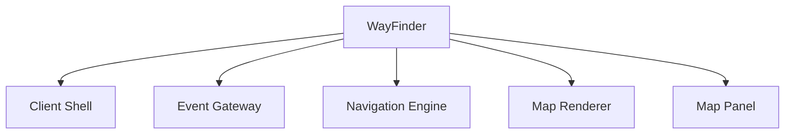
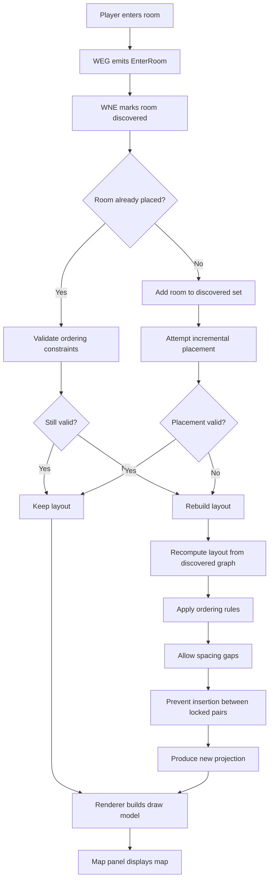

# WayFinder

[]()
[]()
[](https://unlicense.org/)

WayFinder is a MUD client with an integrated navigation system designed for a **specific known world**.

The system builds a readable spatial map of the world **as the player explores**, maintaining a clear projection of discovered rooms while preserving directional relationships.

WayFinder separates:

- **World topology** — authoritative room/exit structure
- **Discovery state** — rooms the player has encountered
- **Map projection** — a readable spatial layout generated from discovered rooms

The map layout is a **projection**, not authoritative. It may rebuild as exploration continues.

---

# Architecture

## Runtime Pipeline


Pipeline shorthand:

```
WTL → WEG → WNE → WMR → WCS
```

---

## Component Model



### Responsibilities

| Component | Responsibility |
|---|---|
| **WTL** | Raw text transport source |
| **WEG** | Convert raw MUD text into structured WayFinder events |
| **WNE** | Maintain the player’s discovered navigation state |
| **WMR** | Project WNE’s discovered topology into map layout/state |
| **WCS** | User-facing shell and orchestration surface |

---

# Discovery → Layout → Rebuild



**Key principle**

World topology and discovery are authoritative.  
The grid layout is a **rebuildable projection**.

---

# Navigation Model

WayFinder maps only the **discovered portion of the world**.

Rules:

- A room becomes discovered when the player enters it
- If a room is discovered, its exits are known
- Undiscovered rooms are not placed on the map
- Layout may rebuild when conflicts appear

---

# Spatial Layout Rules

WayFinder uses **ordered directional constraints**, not rigid one-cell geometry.

Valid relationships include spacing between rooms.

Vertical example:

```
A
.
B
```

Horizontal example:

```
A ... B
```

Constraints:

- Directional ordering must remain correct
- Gaps are allowed
- No room may appear between locked ordered pairs

---

# Repository Structure

```
main.go              application entry point

wcs  WayFinder Client Shell
weg  WayFinder Event Gateway
wne  WayFinder Navigation Engine
wmr  WayFinder Mapping Runtime
wtl  WayFinder Telnet Layer

docs/                detailed architecture documentation
```

Detailed design documentation:

```
docs/architecture.md
docs/discovery_model.md
docs/mapper_rules.md
```

---

# Project Status

WayFinder is under active development.

The navigation engine and discovery model are implemented and being integrated with the client shell and GUI.

## License

WayFinder is released under **The Unlicense**.

Third-party dependencies retain their own licenses:

- github.com/reiver/go-telnet — MIT